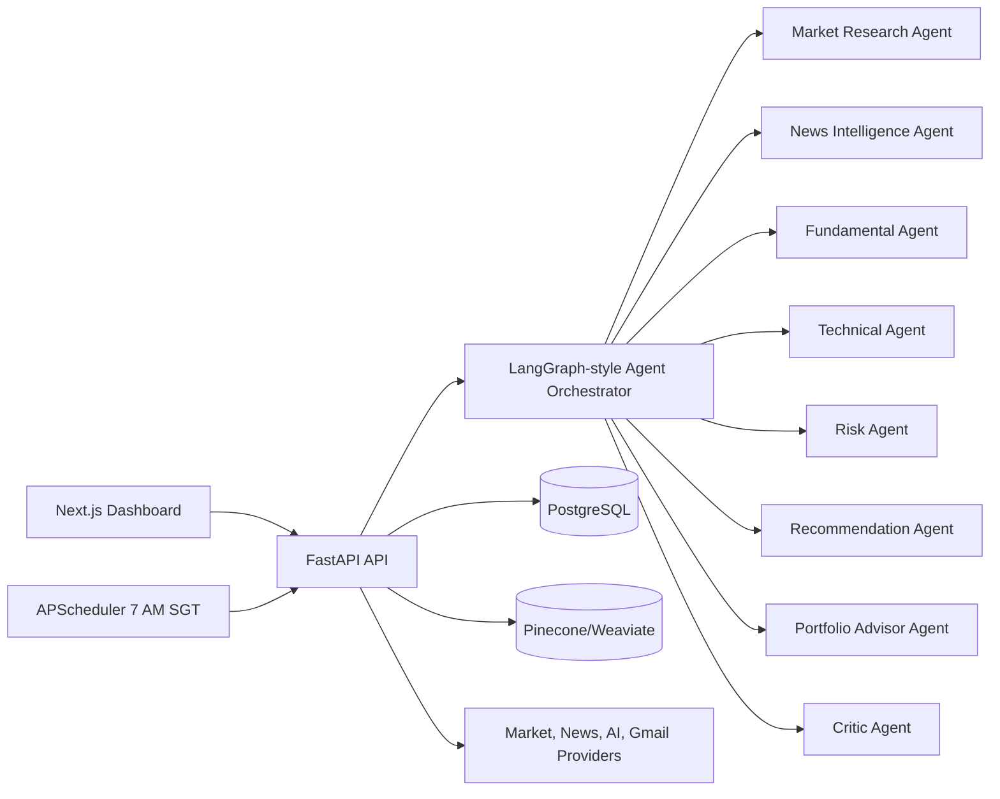

# Singapore Stock Intelligence Platform

Full-stack AI-powered stock intelligence platform for Singapore retail investors trading US and SGX equities.

The project combines a multi-agent deep research workflow, real-time market/news data integrations, portfolio monitoring, recommendations, explainable research reports, Gmail delivery, and deployment-ready infrastructure.

## Apps

- `apps/web` - Next.js, TypeScript, Tailwind CSS dashboard.
- `apps/api` - Python FastAPI backend with agent orchestration, APIs, scheduler, and email services.

## Core Capabilities

- Market overview for US and Singapore markets.
- Stock research pages with fundamentals, technicals, news, and AI insights.
- Evidence-backed Buy/Hold/Sell recommendations.
- Deep research reports with citations and critic review.
- Portfolio and watchlist monitoring.
- Daily 7:00 AM SGT recommendation report.
- Gmail API or SendGrid delivery adapters.

## Quick Start

### Backend

```bash
cd apps/api
python -m venv .venv
.venv\Scripts\activate
pip install -r requirements.txt
copy .env.example .env
uvicorn app.main:app --reload --port 8000
```

### Frontend

```bash
cd apps/web
npm install
npm run dev
```

Open `http://localhost:3000`.

## Publish to GitHub

The target repository is:

```text
https://github.com/ChenGuizi/investment_sg_grace
```

It is currently an empty public repository. Once Git is available locally:

```bash
git init
git branch -M main
git remote add origin https://github.com/ChenGuizi/investment_sg_grace.git
git add .
git commit -m "Build stock intelligence platform scaffold"
git push -u origin main
```

## Environment

See:

- `apps/api/.env.example`
- `apps/web/.env.example`

Most external integrations are adapter-based. The app runs with deterministic demo data until market data, news, AI, vector database, and email credentials are configured.

## Architecture



## Production Notes

- Replace demo providers in `apps/api/app/providers` with paid data providers such as Polygon, Finnhub, Alpha Vantage, IEX Cloud, SGX feeds, or broker APIs.
- Configure OAuth consent and Gmail scopes before enabling Gmail delivery.
- Use managed Postgres and a managed vector database in production.
- Put the API behind TLS with rate limiting and authentication enabled.
- Add human review and clear disclaimers before using automated recommendations with real capital.

## Disclaimer

This application is research software. It does not provide financial advice. Investors should verify all data and make their own decisions.
